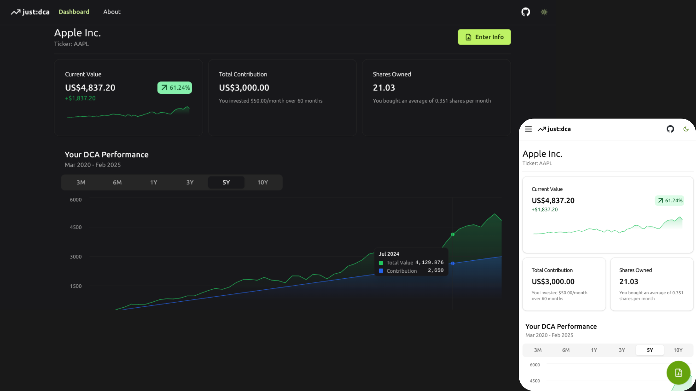

<h1 align="center">just:dca</h1>



[just:dca](https://just-dca.pages.dev/) helps you **visualize** dollar-cost averaging returns of listed **stocks** and **cryptocurrencies**. View how consistent investments over time can impact your financial growth today.

## Dollar-Cost Averaging (DCA)

DCA is the practice of investing a fixed amount of money at regular intervals over a period of time into the same assets, regardless of market conditions.

It's a good way to develop a good investing habit while removing the need to time the market.

Not convinced? Take a look at historical returns using this strategy with [just:dca](https://just-dca.pages.dev/) today.

## Disclaimer

Content is for informational/educational purposes only and should not be treated as financial advice.

## Getting Started

To set-up the website locally, see [here](https://github.com/junnjiee16/just-dca/blob/main/website/README.md).

To set-up the backend locally, see [here](https://github.com/junnjiee16/just-dca/blob/main/backend/README.md).

To start-up both backend and website local development servers with one command (after you have set-up both projects):

```
./start.sh
```

The script assumes that you use `gnome-terminal`. Change it to your terminal emulator if necessary.

## Suggest a feature or report bugs?

Open an [issue](https://github.com/junnjiee16/just-dca/issues).

## License

[MIT](https://github.com/junnjiee16/just-dca).
